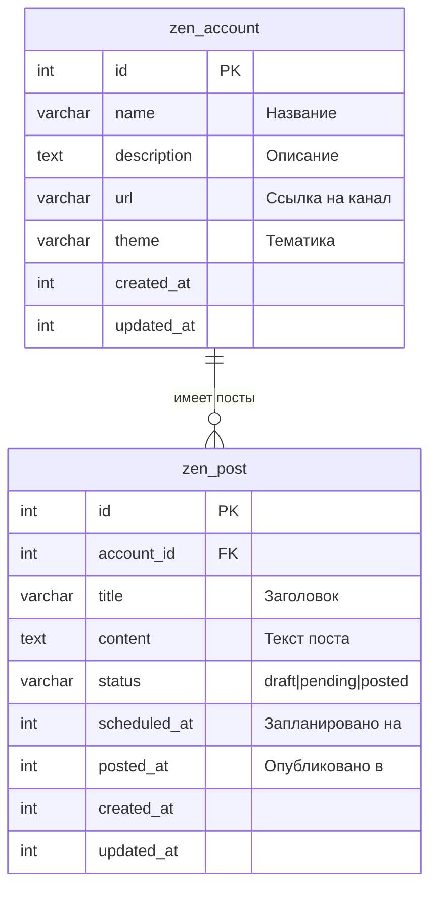

# Схема БД: аккаунты Яндекс.Дзен и посты

## Описание

- **zen_account** — аккаунты (каналы) Яндекс.Дзен. У каждого: название, описание, ссылка на канал, тематика. Аккаунты можно создавать и удалять.
- **zen_post** — посты для постинга в канал. Привязаны к аккаунту. Статусы: черновик (`draft`), ожидает постинга (`pending`), запощено (`posted`). Можно указывать запланированное время и время публикации.

## ER-диаграмма (Mermaid)



## Связи

| Таблица      | Связь           | Описание |
|-------------|-----------------|----------|
| zen_account | 1 → N zen_post  | У одного аккаунта много постов. При удалении аккаунта посты удаляются (CASCADE). |

## Статусы поста (zen_post.status)

| Значение  | Описание            |
|----------|---------------------|
| `draft`  | Черновик            |
| `pending`| Ожидает постинга    |
| `posted` | Запощено            |

## Применение миграции

```bash
php yii migrate
```
